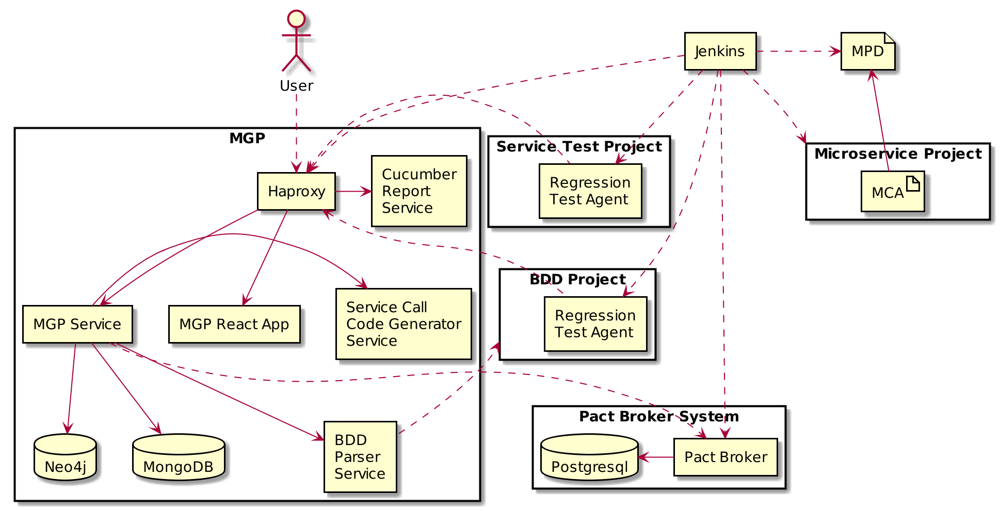
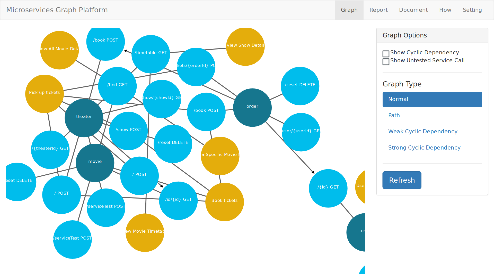
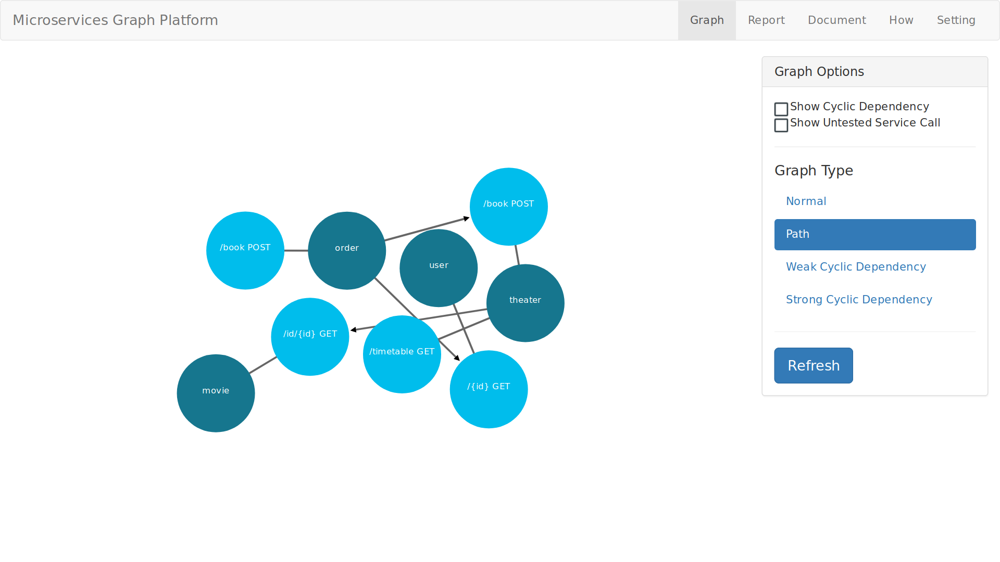
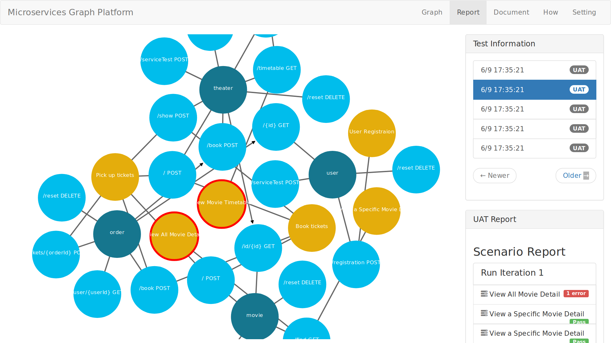
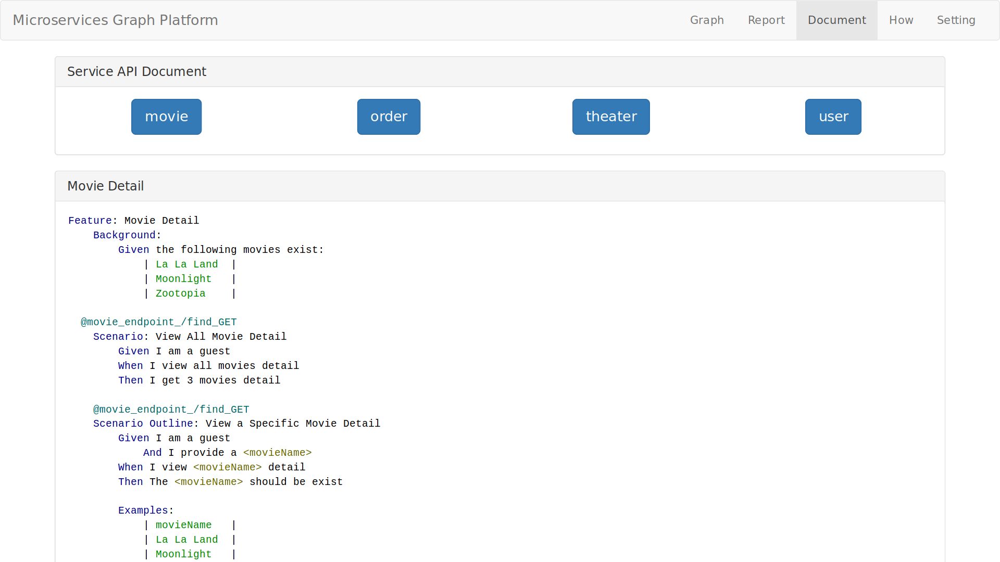
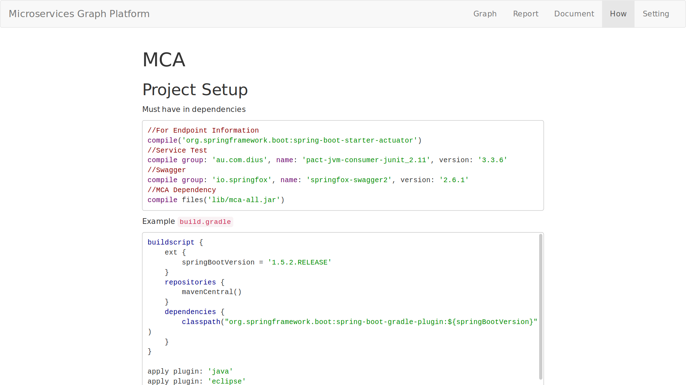
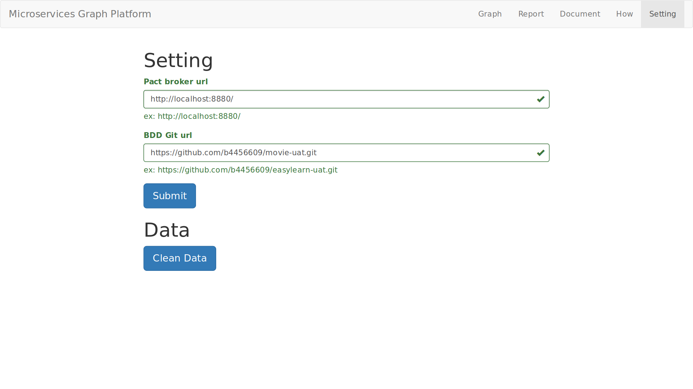

# mgp



## Screenshot








```
mgp : build mgpback spring boot ----------- 70.75s
mgp : build container -------------------- 570.99s
mgp : run container ----------------------- 30.88s
movie : build all jar -------------------- 198.36s
movie : build example docker container ---- 12.60s
movie : run docker ------------------------- 3.49s
test : unit test ------------------------- 212.23s
test : service test ----------------------- 32.72s
test : uat test --------------------------- 46.32s

total 0:23:10.374
```

# Run requirement
The vm require 8G ram
- vagrant
- virtualbox
- ansible
```sh
sudo ansible-galaxy install -r requirements.yml
vagrant up
```

|NAMES                        |PORTS                         |
|-----------------------------|------------------------------|
|movieexample_theater_1       |0.0.0.0:8084->8080/tcp        |
|movieexample_order_1         |0.0.0.0:8083->8080/tcp        |
|movieexample_user_1          |0.0.0.0:8082->8080/tcp        |
|movieexample_zuul_1          |0.0.0.0:8080->8080/tcp        |
|movieexample_movie_1         |0.0.0.0:8081->8080/tcp        |
|movieexample_orderdb_1       |                              |
|movieexample_theaterdb_1     |                              |
|movieexample_eureka_1        |                              |
|movieexample_userdb_1        |                              |
|movieexample_moviedb_1       |                              |
|mgpfront_front_1             |0.0.0.0:4000->80/tcp          |
|mgpfront_api_1               |                              |
|mgpfront_neo_1               |                              |
|mgpfront_web_1               |                              |
|mgpfront_report_1            |                              |
|mgpfront_codegen_1           |                              |
|mgpfront_mongo_1             |                              |
|mgpfront_bdd_1               |                              |
|tool_pactbroker_1            |443/tcp, 0.0.0.0:8880->80/tcp |
|tool_postgresql_1            |0.0.0.0:5432->5432/tcp        |
